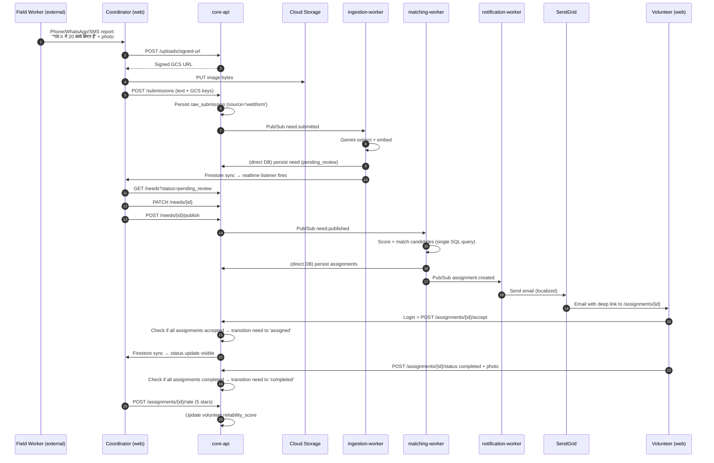
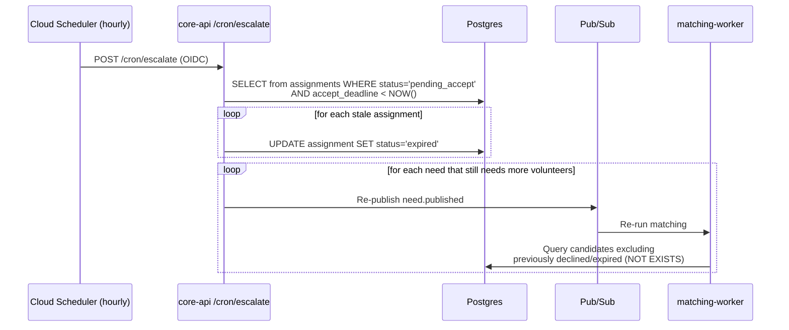

# 01 — System Architecture (Deep Dive)

## 1. Logical Architecture

The system is organized into **5 layers**:

1. **Client Layer** — Web app (Next.js) for coordinator, volunteer, admin
2. **Edge Layer** — CDN, WAF, load balancer
3. **Service Layer** — FastAPI core + 4 async workers on Cloud Run
4. **AI Layer** — Vertex AI (Gemini 2.5 Flash + text-embedding-004)
5. **Data Layer** — Cloud SQL (Postgres + PostGIS + pgvector), Firestore (realtime mirrors), GCS

No PWA, no offline queue, no BigQuery, no Document AI, no Cloud Tasks, no FCM. These were removed because they add complexity without serving a real user need for an 11-day MVP.

## 2. Physical Deployment (GCP asia-south1)

```
                               ┌───────────────┐
                               │  Cloud DNS    │
                               └──────┬────────┘
                                      │
                           ┌──────────▼─────────┐
                           │ HTTP(S) Load Bal.  │
                           │  + Cloud Armor WAF │
                           │  + Cloud CDN       │
                           └──┬──────────────┬──┘
                              │              │
                   /api/*     │              │   /*  (static/SSR)
                              │              │
               ┌──────────────▼──┐       ┌──▼────────────────┐
               │  Cloud Run:     │       │  Cloud Run:       │
               │  core-api       │       │  web-frontend     │
               │  (FastAPI)      │       │  (Next.js)        │
               └──┬───────┬──────┘       └───────────────────┘
                  │       │
          (sync)  │       │ (async via Pub/Sub)
                  │       │
        ┌─────────▼──┐   ┌▼─────────────┐   ┌────────────────┐   ┌────────────────┐
        │  Cloud SQL │   │ ingestion-wk │   │ matching-wk    │   │ notification-wk│
        │  Postgres  │   │  Cloud Run   │   │  Cloud Run     │   │  Cloud Run     │
        │  + PostGIS │   │              │   │                │   │                │
        │  + pgvector│   └──────┬───────┘   └────────┬───────┘   └────────┬───────┘
        └─────▲──────┘          │                    │                    │
              │                 │                    │                    │
        ┌─────┴──────┐          │                    │                    │
        │  Firestore │◀─────────┴────────────────────┘                    │
        │ (realtime  │     via sync_firestore() helper                    │
        │  mirrors)  │                                                    │
        └────────────┘                                                    │
                                                                          │
        ┌────────────┐                                                    │
        │   GCS      │                                                    │
        │ (images)   │                                                    │
        └────────────┘                                                    │
                                                                          │
        ┌────────────────────────────────────────────┐                    │
        │  Vertex AI                                 │                    │
        │  ├─ gemini-2.5-flash                       │                    │
        │  │    (extract + translate + report text)  │                    │
        │  └─ text-embedding-004                     │                    │
        └────────────────────────────────────────────┘                    │
                                                                          │
                                                  ┌───────────────────────┘
                                                  ▼
                                   ┌───────────────────────────┐
                                   │  External Channels        │
                                   │  └─ SendGrid (email)      │
                                   └───────────────────────────┘

        ┌──────────────────────┐         ┌─────────────────────────┐
        │  Cloud Scheduler     │──cron──▶│  core-api /cron/*       │
        │  - weekly report     │         │  (OIDC-authenticated)   │
        │  - hourly escalate   │         └─────────────────────────┘
        └──────────────────────┘
```

## 3. Service Responsibilities

### 3.1 `core-api` (FastAPI)
- All synchronous REST calls from clients
- Auth verification (Firebase ID token)
- CRUD on all business entities — every mutation uses `sync_firestore()` helper
- Publishes events to Pub/Sub **after** Postgres commit
- **Never does AI calls synchronously** — defers to workers
- Signed URLs for GCS uploads (both submission images and completion photos)
- Hosts `/cron/*` endpoints for Cloud Scheduler (OIDC-authenticated)

### 3.2 `ingestion-worker`
- Pub/Sub push subscriber on `need.submitted`
- Fetches raw submission from DB
- Calls Gemini 2.5 Flash multimodal extraction
- Generates embedding via `text-embedding-004`
- Writes `needs` row directly to Postgres in `pending_review` state
- Calls `sync_firestore('needs', id)` so the coordinator's review-queue listener fires
- Retries: 3 attempts with exponential backoff via Pub/Sub DLQ

### 3.3 `matching-worker`
- Pub/Sub push subscriber on `need.published`
- Computes deterministic priority score (pure Python, no AI)
- Queries candidate volunteers (PostGIS + pgvector + availability JOIN + previous-attempt filter)
- Runs ranking + team formation (greedy → Hungarian fallback)
- Writes `assignments` rows directly to Postgres
- Transitions `needs.status` to `matching_complete` (or back to `published` if no candidates)
- Calls `sync_firestore('assignments', id)` for each assignment
- Emits `assignment.created` events

### 3.4 `notification-worker`
- Pub/Sub push subscriber on `assignment.created`
- Renders Jinja2 email template in volunteer's `preferred_language` (en/hi/gu)
- Sends via SendGrid transactional email API
- Writes `notifications` row directly to Postgres for the in-app inbox
- Subscribes to SendGrid event webhook (`delivered`, `bounced`, `spam_report`) to update `notifications.status`
- On permanent bounce, flags the volunteer record and notifies admin

### 3.5 `reports-worker`
- Cloud Scheduler triggers weekly (Mon 06:00 IST) by calling `/cron/weekly-report` on core-api
- core-api publishes a Pub/Sub event to this worker
- Queries Postgres for weekly aggregates (no BigQuery needed for MVP scale)
- Calls Gemini to generate narrative
- Renders PDF (WeasyPrint)
- Uploads to GCS + writes signed URL to the coordinator's in-app inbox

## 4. Write-Path Policy (single source of truth)

This is the rule that prevents data drift:

1. **Postgres is ALWAYS written first.**
2. **Any code that writes Postgres also calls `sync_firestore(entity, id)` in the same transaction handler.** The helper re-reads from Postgres and writes the Firestore mirror. This is the ONLY path to Firestore.
3. **Pub/Sub events are published AFTER the Postgres commit.** If the commit fails, no event goes out.
4. **Workers write their own domain's Postgres data directly** (they have DB credentials). They do NOT call core-api over HTTP to do writes. But they use the same `sync_firestore` helper, imported from a shared package.

### `sync_firestore()` helper

```python
# shared/firestore_sync.py
async def sync_firestore(entity_type: str, entity_id: UUID):
    """Re-read from Postgres and write the Firestore mirror.
       Idempotent — safe to call multiple times."""
    if entity_type == "needs":
        need = await db.fetch_one("SELECT id, title, status, priority_score, ... FROM needs WHERE id=$1", entity_id)
        await fs.collection("needs_realtime").document(str(entity_id)).set({
            "status": need.status,
            "title": need.title,
            "priority_score": need.priority_score,
            "last_updated": datetime.utcnow(),
        })
    elif entity_type == "assignments":
        assignment = await db.fetch_one("SELECT ... FROM assignments WHERE id=$1", entity_id)
        await fs.collection("task_status").document(str(entity_id)).set({
            "status": assignment.status,
            "volunteer_id": str(assignment.volunteer_id),
            "need_id": str(assignment.need_id),
            "last_updated": datetime.utcnow(),
        })
    # ...
```

### Calling it

```python
# In any handler (API or worker)
async with db.transaction():
    await db.execute("UPDATE needs SET status='published' WHERE id=$1", need_id)
    await sync_firestore("needs", need_id)
await pubsub.publish("need.published", {"need_id": str(need_id)})
```

The transaction boundary ensures: if the Firestore write fails, the Postgres write rolls back. (In practice, we use a best-effort pattern: Firestore write is outside the transaction with a try/except, because Firestore outages are rarer than DB contention, and the mirror will be refreshed on the next update anyway. Document this explicitly if asked.)

## 5. Sequence Diagrams

### 5.1 End-to-End Happy Path



### 5.2 Hourly Escalation Sweep



## 6. Data Flow Boundaries

| Boundary | Protocol | Auth |
|---|---|---|
| Client ↔ LB | HTTPS | Firebase ID Token (Bearer) |
| LB ↔ Cloud Run | HTTPS (internal) | Cloud Run invoker IAM |
| Cloud Run ↔ Cloud SQL | Cloud SQL Connector + IAM | IAM auth, no passwords |
| Cloud Run ↔ Vertex AI | gRPC | Service account |
| Cloud Run ↔ GCS | HTTPS | Service account; client uses signed URLs |
| Cloud Run ↔ Pub/Sub | gRPC | Service account |
| Pub/Sub ↔ Worker | HTTPS push | OIDC token verification |
| Cloud Scheduler ↔ core-api `/cron/*` | HTTPS | OIDC token verification |
| notification-worker ↔ SendGrid API | HTTPS | API key from Secret Manager |
| SendGrid ↔ core-api `/webhooks/sendgrid` | HTTPS webhook | Signed event payload (ED25519 public-key verify) |

## 7. Pub/Sub Topics & Subscriptions (complete list)

| Topic | Publisher | Subscriber | Purpose |
|---|---|---|---|
| `need.submitted` | core-api (on new raw_submission) | ingestion-worker | Trigger AI extraction |
| `need.published` | core-api (on publish) or /cron/escalate (on re-queue) | matching-worker | Trigger matching |
| `assignment.created` | matching-worker | notification-worker | Send email notification |
| `task.completed` | core-api (on status='completed') | reports-worker (optional, for real-time metrics) | Future: real-time impact feed |

Each topic has a dead-letter queue after 5 failed attempts. No `need.extracted` topic — it was removed because nothing subscribed to it.

## 8. Scaling Strategy

| Component | MVP | Scale-up Path |
|---|---|---|
| core-api | 1 Cloud Run instance, min=0 | Set min=2, max=10, concurrency=80 |
| Workers | 1 each, min=0 | min=1 each, max=5, adjust Pub/Sub flow control |
| Cloud SQL | db-f1-micro (shared CPU, 0.6GB) | db-custom-2-7680; enable read replicas |
| Vector search | pgvector on Cloud SQL (ivfflat index, lists=100) | Migrate to Vertex AI Matching Engine if > 100k volunteers |
| Realtime | Firestore | Native scales automatically |
| Storage | GCS Standard | Lifecycle rule → Nearline after 30 days |

## 9. Observability

- **Structured JSON logs** via `loguru` — all logs include `request_id`, `user_id` (hashed), `route`
- **Cloud Trace** — auto-propagated via `opentelemetry` middleware
- **Metrics:** request rate, p50/p95/p99 latency, error rate, Pub/Sub backlog, Vertex AI token usage
- **Alerting:**
  - Error rate > 2% for 5 min
  - p95 latency > 2s
  - Pub/Sub backlog > 100 messages
  - Vertex AI quota > 80%

## 10. Disaster Recovery

- Cloud SQL **automated backups** — daily, 7-day retention
- GCS **versioning** on the images bucket
- Point-in-time recovery on Postgres
- Regular `pg_dump` to a backup GCS bucket
- Runbook for: "DB instance down", "Vertex AI quota hit", "SendGrid outage" (fallback to in-app inbox only; volunteers see assignments on next login)
