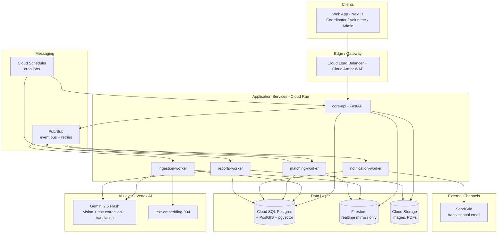
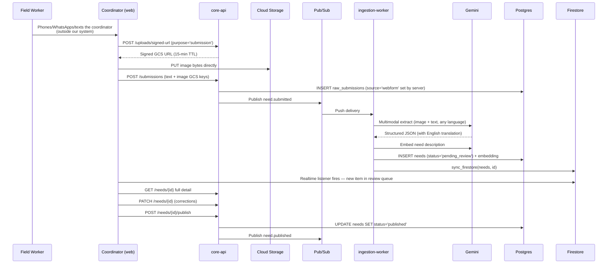
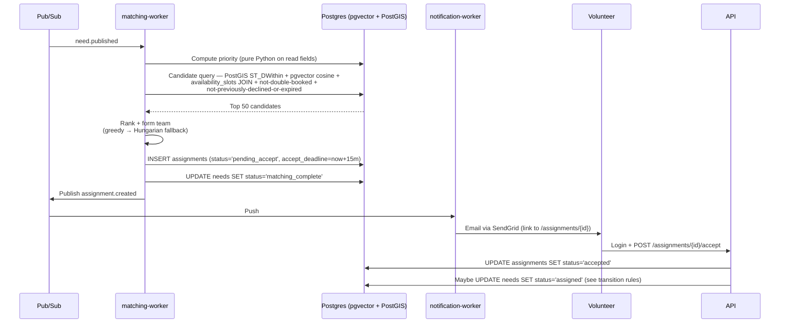
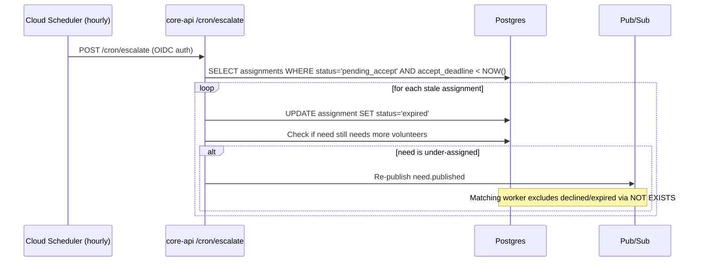

# Nectaid — Smart Resource Allocation for Social Impact

> **Nectaid** — a portmanteau of *connect* + *aid*. A data-driven volunteer coordination platform that turns scattered NGO field reports into prioritized, assigned action. Where community needs meet volunteer skill.

**Theme:** [Smart Resource Allocation] Data-Driven Volunteer Coordination for Social Impact
**Target:** Prototype submission by April 28, 2026
**Platform:** Desktop-first responsive web application (works on tablet; phone reachable but not a demo target)
**Cloud:** Google Cloud Platform (using free credits)

---

## Table of Contents

1. [Is This Idea Good? Honest Evaluation](#1-is-this-idea-good-honest-evaluation)
2. [What We're Building](#2-what-were-building)
3. [System Architecture](#3-system-architecture)
4. [Tech Stack (Google Cloud Native)](#4-tech-stack-google-cloud-native)
5. [Core Workflows](#5-core-workflows)
6. [AI Pipeline](#6-ai-pipeline)
7. [Priority Scoring & Matching Algorithm](#7-priority-scoring--matching-algorithm)
8. [Database Schema](#8-database-schema)
9. [API Specification](#9-api-specification)
10. [Security & Privacy](#10-security--privacy)
11. [Deployment Guide](#11-deployment-guide)
12. [11-Day Implementation Roadmap](#12-11-day-implementation-roadmap)
13. [How We Score on the Rubric](#13-how-we-score-on-the-rubric)

Detailed documents for each area are in the [`docs/`](./docs) folder.

---

## 1. Is This Idea Good? Honest Evaluation

### Strengths of Your Original Idea
- **Real problem.** NGOs genuinely lose insight because field data (surveys, phoned-in reports, paper forms) never reaches analytics.
- **AI is genuinely needed.** This isn't "AI for AI's sake" — without an LLM/vision model, you cannot structure photographs of paper forms and Hindi/Gujarati text notes into records.
- **Measurable impact.** Weekly reports map directly to the "Expected Impact" criterion.

### Key Design Decision: Where the Humans Actually Are

This is the decision everything else flows from:

- **Coordinators (NGO office staff)** use the **web app** on a desktop/laptop. They are the single intake point — they enter field data (text, photos of paper surveys, details phoned in by field workers), review AI extractions, publish needs, and monitor dashboards. This matches how NGOs already operate: field staff phone HQ with what they've found; HQ does the paperwork.
- **Volunteers** (doctors, teachers, engineers registering to help) use the **web app** from their laptop or phone browser. They register once, receive **email notifications** when matched, log in, and accept or decline.
- **Field workers** do not use our system. They communicate with coordinators through whatever already works (phone call, WhatsApp, SMS, in-person) — that's outside our scope. We upgrade HQ's intake process, not the field comms layer.

**No mobile app. No PWA offline queue. No WhatsApp integration.** These are deliberate trade-offs:

- Coordinators sit at desks with stable internet. Offline capability serves no real user.
- Email is the professional channel for professional volunteers. Doctors and teachers already live in their inbox; WhatsApp would feel spammy and informal.
- WhatsApp Business API requires Meta verification delays, template approval, per-message costs (since July 2025), and an HMAC webhook security layer. For 11 days, that's integration risk without proportional user benefit.

### Weaknesses We Are Fixing in This Design

| Your Original Plan | Problem | What We Do Instead |
|---|---|---|
| "AI gives priority score" | LLM scoring alone is inconsistent and unauditable. Judges will ask "why 8.2 and not 7.9?" | **Hybrid scoring**: deterministic formula over structured fields (urgency, severity, beneficiaries, time-decay). No LLM in the scoring path. |
| "Assign task to a volunteer" | Ignores team formation and multi-skill needs | **Greedy skill-covering assignment** with **Hungarian algorithm fallback** when greedy can't cover all required skills |
| "Match by availability + location" | Too shallow. Doesn't handle skill semantics ("pediatrician" vs "general physician") | **Embedding-based semantic matching** using Vertex AI text embeddings + geospatial filter + availability window |
| No human review step | AI extraction from unstructured data has ~15–25% error rate. Publishing wrong data hurts trust | **Human-in-the-loop**: coordinator reviews every extraction before publishing |
| No notification layer | How does the doctor actually find out? | **Email notifications** (SendGrid) with a deep link to the in-app accept/decline screen. Simple, professional, zero ongoing cost. |
| No multilingual | 70%+ of field data in Gujarat is Gujarati/Hindi | **Gemini handles translation natively** during extraction; UI strings via i18n |
| No feedback loop | One-shot system can't improve | **Post-task rating** by coordinator feeds into volunteer reliability score |

### Innovation Hooks (For the 25% Innovation Score)

1. **Multimodal multilingual extraction.** The coordinator pastes text, uploads a photo of a handwritten paper survey, or types in what a field worker phoned in — Gemini 2.5 Flash returns a structured, translated, priority-scored need in under 15 seconds.
2. **Explainable priority scoring.** Every score shows its breakdown. Judges see exactly *why* this need scored 78.4.
3. **Team auto-formation.** If a need requires "doctor + nurse + translator," the system assembles the team in one shot — not just picks one person. Greedy skill-covering with Hungarian-algorithm fallback.
4. **Cross-lingual semantic matching.** A volunteer profile in English matches a need in Hindi because the concepts live close in vector space.
5. **Pure-Postgres stack.** Geospatial + vector + relational + audit in one database. Judges reviewing the code see elegance, not sprawl.
6. **Trustworthy AI for social work.** Every AI output is schema-validated, human-reviewed, and the scoring is fully deterministic and auditable — appropriate for a domain where wrong decisions hurt real beneficiaries.

### Verdict

**Yes, ship this idea.** It's implementable in 11 days by a small team if you follow the scope discipline in the [roadmap](#12-11-day-implementation-roadmap).

---

## 2. What We're Building

### One-Line Pitch
> A desktop web platform where NGO coordinators enter messy field data (text, photos of surveys, phoned-in reports) and get back a prioritized queue of community needs — automatically matched to volunteer teams with the right skills, location, and availability, with email notifications driving the accept/decline loop.

### User Personas

| Persona | What They Do | Primary Device |
|---|---|---|
| **Coordinator** (NGO staff) | Enters field data, reviews AI extractions, publishes needs, monitors dashboards, reads weekly reports | Desktop/laptop |
| **Volunteer** (doctor, teacher, engineer) | Registers with skills & availability, receives email notifications, accepts/declines via web, updates task status | Laptop or phone browser |
| **Admin** (NGO leadership) | Verifies volunteers, views org-wide analytics, tunes priority weights | Desktop/laptop |

Field workers are *not* direct users. They communicate with coordinators through whatever they already use (phone, WhatsApp, SMS, in person) — that layer is outside our system boundary. We upgrade HQ's intake process, not the field comms layer.

### Core Functional Requirements

1. **Ingest** unstructured data via the coordinator web form: text + images (photos of surveys, handwritten forms, situation photos)
2. **Extract** structured fields: location, need type, beneficiaries, urgency, resources required, skill needs
3. **Review** extractions (human-in-the-loop)
4. **Score** each need deterministically + show the breakdown
5. **Match** volunteers or form teams using skill embeddings + location + availability
6. **Notify** matched volunteers via email (SendGrid) with a deep link to the accept/decline screen
7. **Track** task status: Assigned → Accepted → In-Progress → Completed → Reviewed
8. **Report** weekly analytics: needs resolved, avg response time, beneficiaries served, volunteer-hours, geographic heatmap

### Non-Functional Requirements

- **Desktop-first responsive** (Tailwind breakpoints; works fine on tablet, usable on phone browser but not the demo target)
- **Multilingual**: Hindi, Gujarati, English
- **Secure**: role-based access, encrypted PII, audit log
- **Scalable**: stateless services on Cloud Run → scales to 0 and up
- **Cheap**: stays within Google Cloud free tier / credits

---

## 3. System Architecture

### High-Level Architecture



### Component Responsibilities

| Component | Responsibility |
|---|---|
| **core-api** | REST API for all CRUD + auth. FastAPI on Cloud Run. Stateless. |
| **ingestion-worker** | Pub/Sub subscriber on `need.submitted`. Calls Gemini for extraction + embedding. Writes `needs` row in `pending_review`. |
| **matching-worker** | Pub/Sub subscriber on `need.published`. Computes priority + matches + creates assignments. Emits `assignment.created`. |
| **notification-worker** | Pub/Sub subscriber on `assignment.created`. Sends email via SendGrid + writes in-app notification row. |
| **reports-worker** | Cloud Scheduler triggers weekly. Queries Postgres aggregates, Gemini writes narrative, renders PDF, uploads to GCS. |
| **Cloud Scheduler** | Two cron jobs: (1) weekly report generation, (2) hourly `escalate_stale_assignments` sweep that finds assignments past their `accept_deadline` and reassigns. |
| **Vertex AI** | Gemini 2.5 Flash (extraction, translation, report narrative) + `text-embedding-004` (semantic matching). |
| **Cloud SQL (Postgres + PostGIS + pgvector)** | Source of truth for all business data. Geospatial, vector, relational, audit log — all here. |
| **Firestore** | Read-only realtime mirrors of a few fields (task status, coordinator feed). Never source of truth. |
| **Cloud Storage** | Images (submissions + completion proofs) + weekly PDF reports. All access via signed URLs. |
| **Pub/Sub** | Event bus. Topics: `need.submitted`, `need.published`, `assignment.created`, `task.completed`. Built-in retries + dead-letter queue per topic. |
| **SendGrid** | Transactional email for assignment notifications, rating requests, admin alerts. Free tier: 100/day. |

### Write-Path Policy (Single Source of Truth)

A recurring design mistake is having three places that can write the same fact. We avoid this with one rule:

1. **Postgres is always written first.** Every state change lands in Postgres before anything else happens.
2. **Whoever updates Postgres is also responsible for updating Firestore** via a single helper `sync_firestore(entity_type, entity_id)`. The helper re-reads Postgres and writes the mirror. No other code path writes to Firestore.
3. **Pub/Sub events are emitted after the Postgres commit**, never before.
4. **Workers write their own domain's Postgres updates directly** (they have DB credentials). They do NOT call the core-api over HTTP to do writes. But they still use the same `sync_firestore` helper for Firestore mirrors.

Every state change looks like:
```python
async with db.transaction():
    await db.execute(update_stmt)           # 1. Postgres write
    await sync_firestore(entity, entity_id) # 2. Firestore mirror
await pubsub.publish(event)                  # 3. Event after commit
```

### Why This Architecture

- **Event-driven, not request-chained.** Ingestion → Matching → Notification happen asynchronously via Pub/Sub. The coordinator's UI doesn't block on AI calls.
- **Cloud Run everywhere.** Scales to zero (free when idle), autoscales under load. No server management.
- **Postgres does everything.** One database for relational + geospatial (PostGIS) + vector (pgvector) + audit. No separate vector DB, no separate warehouse.
- **Firestore only for realtime.** Not source of truth. Only mirrors fields the UI wants to listen to without polling.

See [`docs/01_system_architecture.md`](./docs/01_system_architecture.md) for deeper diagrams and sequence flows.

---

## 4. Tech Stack (Google Cloud Native)

### Stack Summary

| Layer | Choice | Rationale |
|---|---|---|
| **Frontend** | Next.js 15 (App Router) + TypeScript + TailwindCSS + shadcn/ui + TanStack Query | Desktop-first responsive. No PWA, no service worker, no offline queue. |
| **i18n** | `next-intl` with Hindi/Gujarati/English bundles | Multilingual UI |
| **Backend** | FastAPI (Python 3.12) + Pydantic v2 + SQLAlchemy 2 (async) + Alembic | Python chosen because Vertex AI SDK is Python-first |
| **Background Jobs** | Separate Cloud Run services triggered by Pub/Sub push subscriptions | Scales independently from API |
| **Auth** | Firebase Authentication (email/password + phone OTP) + custom claims for roles | Firebase is free up to 50k MAU |
| **Primary DB** | Cloud SQL PostgreSQL 16 + PostGIS + pgvector | ACID for business data, geospatial for location, vector for semantic matching — one DB |
| **Realtime DB** | Firestore (Native) — mirrors only | Realtime listeners for task status, coordinator feed |
| **Blob Storage** | Cloud Storage (GCS) | Images, PDFs; signed URLs for access |
| **AI / ML** | Vertex AI: `gemini-2.5-flash` + `text-embedding-004` | Single vendor |
| **Message Queue** | Pub/Sub (events + retries + DLQ) + Cloud Scheduler (cron) | No Cloud Tasks — unnecessary for our timers |
| **Notifications** | SendGrid transactional email + in-app inbox | Free tier (100/day) covers MVP; professional tone for professional volunteers |
| **Analytics** | Direct Postgres aggregate queries for dashboards + weekly reports | No BigQuery for MVP — Postgres is more than enough |
| **Monitoring** | Cloud Logging + Cloud Monitoring + Error Reporting | Integrated |
| **Secrets** | Secret Manager | Never hard-code API keys |
| **CI/CD** | GitHub Actions → `gcloud` → Cloud Run | Push to main = auto-deploy |

### What We Removed From the Original Design (and Why)

| Removed | Why |
|---|---|
| PWA / service worker / offline queue | Coordinators are at desktops. No real user needs offline capability. |
| WhatsApp Business Cloud API | Meta verification delays, template approval queues, per-message costs since July 2025, webhook HMAC complexity. For 11 days, integration risk without proportional user value. |
| Twilio SMS | Fallback-of-a-fallback after WhatsApp was dropped. Paid channel; email covers the use case for free. |
| BigQuery + Datastream CDC | Overkill for MVP scale (< 10k rows). Postgres aggregate queries are instant. |
| Document AI Form Parser | Gemini 2.5 Flash handles forms well enough. Two LLM services for one job is noise. |
| Cloud Tasks | Pub/Sub already has retries + DLQ. The 15-min escalation is handled by an hourly Cloud Scheduler sweep. |
| FCM push notifications | No mobile app means no native push. Email covers the notification use case. |
| `need.extracted` Pub/Sub event | Nothing subscribes to it. Coordinator's UI just reads the Firestore mirror. |
| Hourly priority-recompute job | `time_pressure` is computed on-read in the API response; no persistence, no cron. |

### Cost Estimate for MVP (Monthly, Post-Credits)

Assuming 100 active volunteers, 500 needs/month, 2000 email notifications:

| Service | Estimated Cost |
|---|---|
| Cloud Run (5 services, mostly idle) | $2–5 |
| Cloud SQL (db-f1-micro) | $10–15 |
| Firestore (50k reads, 20k writes) | Free |
| Cloud Storage (20 GB) | $0.40 |
| Vertex AI Gemini (5000 calls) | $3–5 |
| Embeddings (1000 calls) | < $0.10 |
| Pub/Sub | Free tier |
| Firebase Auth | Free |
| SendGrid email | Free (100/day = 3000/month covers 2000 notifications) |
| **Total** | **~$15–25/month** |

Fits comfortably inside $300 Google Cloud free credits. Dropping WhatsApp/Twilio shaved off ~$5–10/month.

See [`docs/02_tech_stack.md`](./docs/02_tech_stack.md) for versions and package lists.

---

## 5. Core Workflows

### Workflow A: Ingesting a Need via Coordinator Web Form



### Workflow B: Matching & Team Formation



### Workflow C: Escalation (Stale Assignments)



### Workflow D: Task Lifecycle (Need Status Transitions)

```
pending_review  →  published  →  matching_complete  →  assigned  →  in_progress  →  completed
                                                                          ↓
                                                                      cancelled
```

Rules enforced in API / workers:
- `pending_review → published` when coordinator publishes
- `published → matching_complete` when matching-worker has created all assignments for this need
- `matching_complete → assigned` when all required-role assignments are in `accepted` state
- `assigned → in_progress` when any volunteer marks their assignment `in_progress`
- `in_progress → completed` when every assignment for this need is `completed`
- Any state → `cancelled` by explicit coordinator action

See [`docs/04_api_specification.md`](./docs/04_api_specification.md) and [`docs/06_matching_algorithm.md`](./docs/06_matching_algorithm.md) for details.

---

## 6. AI Pipeline

Three AI jobs, each justified:

### Job 1: Multimodal Extraction (Vision + Text → Structured JSON)
- Model: `gemini-2.5-flash`
- Input: image(s) + text (any language)
- Output: strict JSON matching `NeedExtraction` Pydantic schema (translation included)

### Job 2: Semantic Matching (Embeddings)
- Model: `text-embedding-004` (768 dims)
- Volunteer skills embedding on registration/update
- Need embedding on ingestion
- Cosine similarity in pgvector — handles cross-lingual matching naturally

### Job 3: Report Narrative (Weekly)
- Model: `gemini-2.5-flash`
- Input: aggregated metrics (pure SQL from Postgres)
- Output: 3–5 paragraph narrative for the PDF

We explicitly do NOT use AI for: priority scoring (deterministic formula), matching ranking (weighted scores), or authorization (rules).

See [`docs/05_ai_pipeline.md`](./docs/05_ai_pipeline.md) for prompts, fallbacks, and cost controls.

---

## 7. Priority Scoring & Matching Algorithm

### Priority Score (Explainable, Deterministic)

```
priority = W_u × urgency_value
         + W_s × severity_value
         + W_b × log(1 + beneficiaries)
         + W_t × time_pressure            ← computed on-read from deadline
         − W_r × resource_difficulty
```

`time_pressure` is NOT stored; it's computed from `deadline` every time the score is returned, so we don't need a cron job to refresh scores.

### Matching Algorithm

**Phase 1 — Hard Filter (single SQL query):**
- Volunteer `verified` and `active`
- Within `max_travel_km` (PostGIS `ST_DWithin`)
- Has an `availability_slots` row overlapping the need's time window (**JOIN — not a separate check**)
- Not double-booked (NOT EXISTS subquery with `COALESCE(completed_at, 'infinity'::timestamptz)` for open-ended ranges)
- Not previously declined/expired on this need (`NOT EXISTS` subquery — no extra column needed)

**Phase 2 — Rank (Python):**
```
match_score = 0.5 × semantic_similarity
            + 0.2 × location_score
            + 0.15 × reliability_score
            + 0.10 × experience_score
            + 0.05 × (1 − recency_penalty)
```

`recency_penalty` comes from a subquery counting the volunteer's recent assignments — not a stored column.

**Phase 3 — Team Formation:**
- `team_size == 1` → top-1
- Multi-skill → greedy skill-covering, falls back to **Hungarian algorithm** if greedy leaves skills uncovered

**Phase 4 — Acceptance:**
- 15-min `accept_deadline` per assignment
- Hourly Cloud Scheduler sweep expires stale assignments and re-queues matching

See [`docs/06_matching_algorithm.md`](./docs/06_matching_algorithm.md) for the full SQL and pseudocode.

---

## 8. Database Schema

Full schema in [`docs/03_database_schema.md`](./docs/03_database_schema.md).

The schema has been cleaned up based on review feedback:
- **Dropped the redundant `availability` JSONB column** — only `availability_slots` table is used
- **No `tasks_this_week` column** — computed via subquery
- **No `attempted_volunteer_ids` column** — tracked via `assignments` rows where status is `declined`/`expired`
- `notification_prefs` JSONB stays (it's configuration, not state)
- `needs.status` has explicit transition rules enforced by the API

---

## 9. API Specification

Full spec: [`docs/04_api_specification.md`](./docs/04_api_specification.md).

### Key Endpoints

```
POST   /api/v1/auth/session
GET    /api/v1/auth/me

POST   /api/v1/submissions                # webform ingestion (source='webform' set by server)
POST   /api/v1/uploads/signed-url         # generic signed GCS URL (submissions + completion photos)

GET    /api/v1/needs                      # filters: status, urgency, near_lat/lng
GET    /api/v1/needs/{id}
GET    /api/v1/needs/{id}/explain         # priority breakdown
PATCH  /api/v1/needs/{id}
POST   /api/v1/needs/{id}/publish
POST   /api/v1/needs/{id}/cancel

POST   /api/v1/volunteers
GET    /api/v1/volunteers/me
PATCH  /api/v1/volunteers/me
DELETE /api/v1/volunteers/me              # DPDP right-to-erasure
GET    /api/v1/volunteers/me/assignments

POST   /api/v1/assignments/{id}/accept
POST   /api/v1/assignments/{id}/decline
POST   /api/v1/assignments/{id}/status
POST   /api/v1/assignments/{id}/rate

GET    /api/v1/analytics/dashboard
GET    /api/v1/reports/weekly
GET    /api/v1/reports/weekly.pdf

POST   /api/v1/cron/escalate              # Cloud Scheduler, OIDC auth
POST   /api/v1/cron/weekly-report         # Cloud Scheduler, OIDC auth
POST   /api/v1/webhooks/sendgrid          # SendGrid event webhook, ED25519-signed
```

All user endpoints authenticated via Firebase ID token (`Authorization: Bearer <token>`). Role-based `require_role()` dependency on every route.

---

## 10. Security & Privacy

Full details in [`docs/07_security.md`](./docs/07_security.md).

1. **Auth:** Firebase Auth; roles via custom claims set server-side
2. **Authorization:** `require_role()` + row-level ownership check on every route
3. **Transport:** HTTPS-only, HSTS, TLS 1.2+
4. **Input validation:** Pydantic on every boundary; strict JSON schema for AI outputs
5. **PII handling:** `pgcrypto` encrypted columns for beneficiary names/phones; signed GCS URLs (15-min expiry); no PII in logs
6. **Rate limiting:** Cloud Armor + per-user limits
7. **Secrets:** Secret Manager only
8. **Audit log:** Triggers on `needs` and `assignments`
9. **OWASP Top 10:** covered (see doc)
10. **Prompt injection defense:** user text only in `user` messages, AI output validated against schema
11. **DPDP Act:** consent capture, data residency (asia-south1), right-to-erasure via `DELETE /volunteers/me`

---

## 11. Deployment Guide

Full guide: [`docs/08_deployment.md`](./docs/08_deployment.md).

- Cloud Run for all services (core-api + 4 workers), all in `asia-south1`
- Cloud SQL (Postgres 16, db-f1-micro) with PostGIS + pgvector extensions
- **For local dev:** custom Dockerfile based on `pgvector/pgvector:pg16` with PostGIS installed on top. The default `postgis/postgis` image does NOT include pgvector.
- GitHub Actions → Artifact Registry → Cloud Run on every push to `main`
- Alembic migrations run as a Cloud Run Job before each deploy

---

## 12. 11-Day Implementation Roadmap

Today: **April 17, 2026**. Deadline: **April 28, 2026, 23:59 IST**.

| Day | Focus | Deliverable |
|---|---|---|
| **Day 1 (Apr 17)** | Setup | GCP project, Firebase, repo, CI skeleton, schema migration, local Docker with pgvector+postgis |
| **Day 2 (Apr 18)** | Auth + minimal CRUD | Firebase auth working, 5 core endpoints, deploy staging |
| **Day 3 (Apr 19)** | AI extraction happy path | Gemini extraction + embedding, pending-review list, eval on 10 samples |
| **Day 4 (Apr 20)** | Review → Publish flow | Coordinator review screen, audit log trigger |
| **Day 5 (Apr 21)** | Matching + Scoring | Priority formula, matching worker, team formation, explainability endpoint |
| **Day 6 (Apr 22)** | Volunteer UX | Onboarding, assignment list, accept/decline, status update with photo |
| **Day 7 (Apr 23)** | Realtime + Escalation | Firestore mirrors, hourly escalation cron, need-status transitions |
| **Day 8 (Apr 24)** | Email notifications + intake polish | SendGrid integration, notification worker, rich coordinator submission form |
| **Day 9 (Apr 25)** | Analytics + Reports | Postgres-backed dashboard, weekly PDF generator |
| **Day 10 (Apr 26)** | Polish + i18n | Hindi/Gujarati bundles, empty states, error UX, a11y pass |
| **Day 11 (Apr 27)** | Demo prep | Seed data, demo video, deck, live deploy, eval run |
| **Apr 28** | Submit | Before 23:59 IST |

See [`docs/09_roadmap.md`](./docs/09_roadmap.md) for exit criteria per day and the P0/P1/P2 cut-order scope ladder.

### Team Split (3–5 people)

- **Backend/AI:** FastAPI, Vertex AI, priority scoring, matching worker
- **Frontend:** Next.js, i18n, responsive design (no PWA)
- **Data/DevOps:** schema + migrations, Cloud Run, CI/CD, observability
- **Integrations:** SendGrid email templates, notification worker
- **UX + Demo Director:** design, demo script, video, deck, eval set

---

## 13. How We Score on the Rubric

| Criterion | Weight | Our Story | Evidence in Demo |
|---|---|---|---|
| **Technical Merit** | 40% | 3 distinct AI capabilities (multimodal extraction, embeddings, narrative gen), geospatial + vector + relational in one DB, event-driven workers, Hungarian algorithm fallback for team formation | Architecture diagram + live walkthrough of matching worker code |
| **Alignment with Cause** | 25% | Human-in-the-loop review prevents AI mistakes reaching volunteers. Handles Hindi/Gujarati natively at ingestion. Professional email notifications for professional volunteers. Weekly impact reports, not vanity metrics | Live demo: photo of paper survey → extracted need → matched team → email notification → completed task → report |
| **Innovation and Creativity** | 25% | Multimodal multilingual extraction with schema-validated output, explainable priority scoring, cross-lingual semantic matching, team auto-formation (greedy + Hungarian), pure-Postgres stack (no separate vector DB) | Slide on "what's different" + live priority breakdown tooltip + team-formation demo |
| **User Experience** | 10% | Coordinator gets an opinionated dashboard — review queue on top, priority sorted, explainability on hover. Volunteers get clean professional emails with one-click login to accept | Demo of a coordinator seeing a fresh need and publishing in under 30 seconds |

---

## Documents Index

- [`docs/01_system_architecture.md`](./docs/01_system_architecture.md)
- [`docs/02_tech_stack.md`](./docs/02_tech_stack.md)
- [`docs/03_database_schema.md`](./docs/03_database_schema.md)
- [`docs/04_api_specification.md`](./docs/04_api_specification.md)
- [`docs/05_ai_pipeline.md`](./docs/05_ai_pipeline.md)
- [`docs/06_matching_algorithm.md`](./docs/06_matching_algorithm.md)
- [`docs/07_security.md`](./docs/07_security.md)
- [`docs/08_deployment.md`](./docs/08_deployment.md)
- [`docs/09_roadmap.md`](./docs/09_roadmap.md)

---

## License & Credits

Built for the Smart Resource Allocation challenge on Google Cloud. Open-source after submission under MIT.
